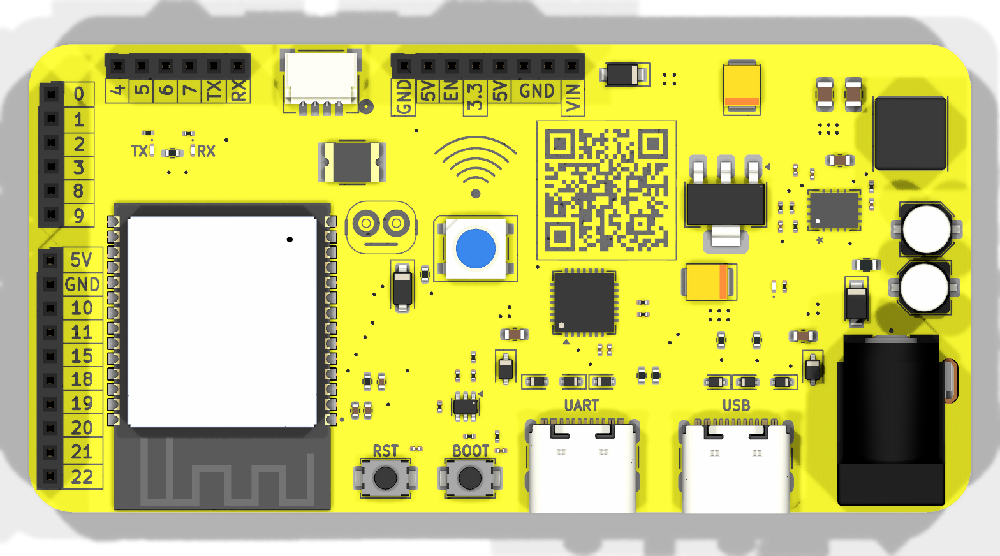

# ESP32-C6 Dev Board
Personal project involving the creation of an ESP32-C6 Dev Board. 

The ESP32-C6 module comes equipped with:
* A 32-bit processor with a clock speed of upto 160 MHz. 
* Supports Wi-Fi 6 and bluetooth 5 (LE) with onboard antenna and thread, zigbee protocols.
* Comes with built in 320KB ROM, 512KB of HP SRAM, 16KB LP SRAM and 4MB Flash memory.
* Adapts multiple IO interfaces and integrates a full-speed USB PHY interface.

The Dev Board includes support for DC input power.



## Getting Started

## Development Environment Setup (Ubuntu)

This project supports firmware development for the **ESP32-C6** using both:

* **C/C++ with ESP-IDF** (official Espressif framework)
* **Rust with esp-rs** (modern, type-safe embedded development)

You can use either workflow independently.

---

## Option A: C/C++ Development (ESP-IDF)

ESP-IDF is Espressif’s official SDK and provides full, first-class support for the ESP32-C6.

### 1. Install System Dependencies

Update your system and install required packages:

```bash
sudo apt update
sudo apt install -y \
  git \
  python3 \
  python3-pip \
  python3-venv \
  cmake \
  ninja-build \
  libusb-1.0-0
```

Verify Python:

```bash
python3 --version
```

---

### 2. Install ESP-IDF

Clone ESP-IDF (recommended stable version):

```bash
git clone -b v5.2 --recursive https://github.com/espressif/esp-idf.git
```

Run the installer:

```bash
cd esp-idf
./install.sh esp32c6
```

Activate the ESP-IDF environment:

```bash
source export.sh
```

To make this persistent, you may add the above line to your `~/.bashrc` or `~/.zshrc`.

Verify installation:

```bash
idf.py --version
```

---

### 3. First Hello World (C/C++)

Create a new project:

```bash
idf.py create-project hello_world
cd hello_world
```

Set the target to ESP32-C6:

```bash
idf.py set-target esp32c6
```

(Optional) Configure the project:

```bash
idf.py menuconfig
```

Important settings:

* Serial port selection
* Flash size (if your PCB differs from defaults)

Build, flash, and monitor:

```bash
idf.py build
idf.py flash monitor
```

Expected serial output:

```
Hello world!
```

Your toolchain is alive and talking.

---

## Option B: Rust Development (esp-rs)

Rust development uses the esp-hal ecosystem and the RISC-V toolchain for ESP32-C6.

---

### 1. Install Rust

Install Rust using `rustup`:

```bash
curl --proto '=https' --tlsv1.2 -sSf https://sh.rustup.rs | sh
```

Reload your shell:

```bash
source ~/.cargo/env
```

Install required components:

```bash
rustup component add rust-src
```

---

### 2. Install ESP Rust Toolchain

Install the ESP toolchain manager:

```bash
cargo install espup
```

Install ESP targets and tools:

```bash
espup install
```

Activate the environment:

```bash
source ~/export-esp.sh
```

Add the ESP32-C6 target:

```bash
rustup target add riscv32imac-unknown-none-elf
```

---

### 3. First Hello World (Rust)

Install the project generator:

```bash
cargo install esp-generate
```

Create a new project:

```bash
cargo generate esp-rs/esp-template
```

During setup:

* Select **esp32c6**
* Choose **no_std**
* Enable **UART logging**

Navigate into the project:

```bash
cd your_project_name
```

Build and flash:

```bash
cargo run
```

Expected output over serial:

```
Hello world from Rust!
```

Rust is officially on the board 🦀.

---